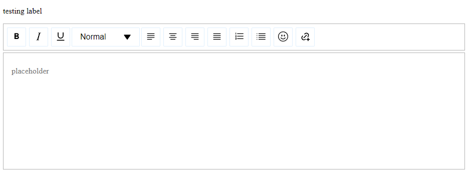
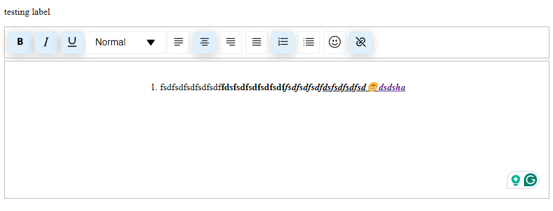

# Simple Rich Text Editor React Component

Simple Rich Text Editor is a customizable, rich-text editor component for React applications. It provides a contenteditable div with various text formatting options, placeholder support, and custom styling capabilities.

## Features

- Rich-text editing capabilities
- Customizable toolbar with various text formatting options
- Placeholder support
- Custom styling options
- Accessibility support
- Event handling for text changes
- Sanitization of input to prevent XSS attacks

## Installation

To use this component in your React project, follow these steps:

``` yarn add rc-rich-text-editor``` 

or

``` npm install rc-rich-text-editor ```

## Usage

Here's a basic example of how to use the Simple Rich Text Editor component:

```jsx
import React from 'react';
import {SimpleRichTextEditor} from 'rc-rich-text-editor';

const MyComponent = () => {
  const handleTextChange = (content) => {
    console.log('Content changed:', content);
  };

  return (
    <SimpleRichTextEditor
      id="my-editor"
      name="my-editor"
      label="My Editor"
      placeholder="Start typing..."
      onTextChange={handleTextChange}
    />
  );
};

export default MyComponent;
```

## Props

The `SimpleRichTextEditor` component accepts the following props:

- `id` (required): Unique identifier for the editor
- `name` (required): Name attribute for the editor
- `label`: Label for the editor
- `initialValues`: Initial HTML content for the editor
- `placeholder`: Placeholder text when the editor is empty
- `controlOptions`: Custom options for the toolbar controls (see Toolbar Customization)
- `wrapperClassName`: Custom class name for the wrapper div
- `editorClassName`: Custom class name for the editor div
- `toolbarClassName`: Custom class name for the toolbar
- `stylePlatte`: Custom styles for various elements of the editor
- `onTextChange`: Callback function called when the text content changes

## Toolbar Customization

The editor includes a customizable toolbar (EditableTopbar) that allows you to control which formatting options are available. You can customize the toolbar using the `controlOptions` prop:

```jsx
const customControlOptions = {
  bold: { show: true, icon: <CustomBoldIcon /> },
  italic: { show: false },
  underLine: { show: true, className: 'custom-underline-btn' },
  // ... other options
};

<SimpleRichTextEditor
  // ... other props
  controlOptions={customControlOptions}
/>
```

## Available Control Options

The toolbar supports the following control options:

1. **Basic Formatting**:
   - `bold`
   - `italic`
   - `underLine`

2. **Text Alignment**:
   - `justifyLeft`
   - `justifyCenter`
   - `justifyRight`
   - `justifyFull`

3. **Lists**:
   - `orderedList`
   - `unorderedList`

4. **Special Features**:
   - `heading`
   - `link`
   - `emoji`

## Customization Properties

For most buttons, you can customize:

- `show`: Boolean to control visibility of the button
- `icon`: Custom React element to replace the default icon
- `className`: Additional CSS class for styling

Special cases:

- **Link**: Has additional `linkIcon` and `unlinkIcon` properties
- **Heading**: Has an additional `dropdownClassName` for styling the dropdown


## Customization Examples

1. **Hide a button**:
   ```javascript
   const customOptions = {
     italic: { show: false }
   };
   ```

2. **Custom icon**:
   ```javascript
   const customOptions = {
     bold: { icon: <MyCustomBoldIcon /> }
   };
   ```

3. **Custom styling**:
   ```javascript
   const customOptions = {
     underLine: { className: 'my-underline-button' }
   };
   ```

4. **Link button customization**:
   ```javascript
   const customOptions = {
     link: {
       show: true,
       linkIcon: <MyLinkIcon />,
       unlinkIcon: <MyUnlinkIcon />,
       className: 'custom-link-button'
     }
   };
   ```

5. **Heading button customization**:
   ```javascript
   const customOptions = {
     heading: {
       show: true,
       dropdownIcon: <MyDropdownIcon />,
       className: 'heading-button',
       dropdownClassName: 'heading-dropdown'
     }
   };
   ```


## Custom Style Palette

You can customize the look and feel of the editor by providing a `stylePlatte` prop. This prop accepts an object with the following keys:

- `primaryColor`
- `primaryColorDark`
- `colorWhite`
- `colorBlack`
- `placeholderTextColor`
- `toolbarBorderColor`
- `editorBorderColor`
- `linkInputBorderColor`
- `linkCancelButtonHoverColor`
- `borderRadius`
- `boxShadowButton`
- `boxShadowFilterButton`
- `boxShadowPopup`


## Screenshot




## Accessibility

The component includes basic accessibility features, such as proper ARIA attributes for the editable div and toolbar buttons.


## Contributing

Contributions are welcome! If you find any issues or want to add new features, feel free to open an issue or submit a pull request.


